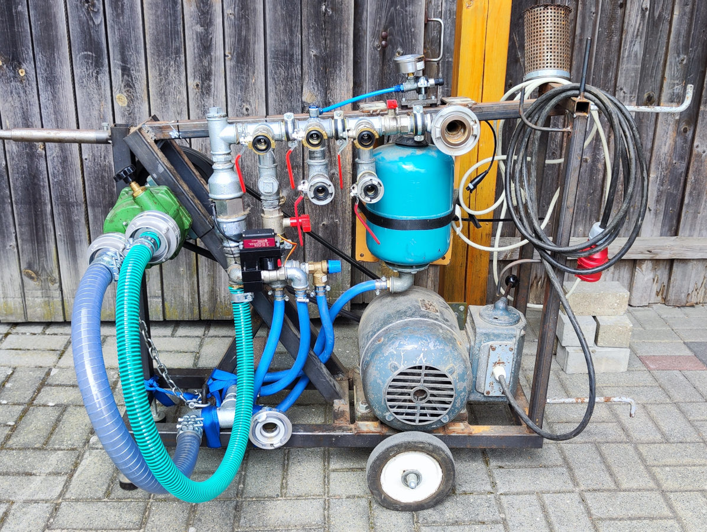
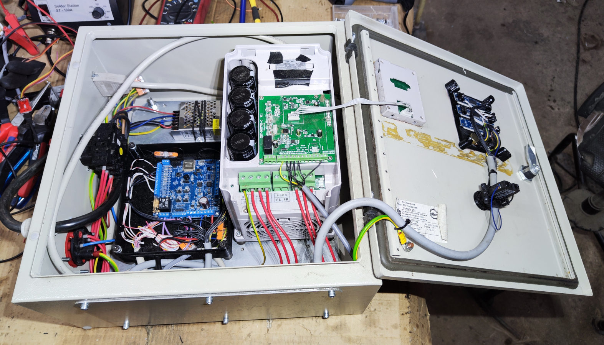

Firmware for controlling a custom built water pump using an esp32 microcontroller.  
Detailed documentation of this project: https://pfusch.zone/regulated-waterpump


# Features
- hardware
    - [x] read pressure-sensor
    - [x] read flow-sensor
    - [x] control VFD
    - [x] control servo motor
    - [ ] monitor temperature
- regulate pressure
    - [x] motor RPM (VFD)
    - [x] bypass valve position (servo)
    - [ ] dynamic target pressure (e.g. reduce pressure when no flow)
- hardware control interface
    - [x] set target pressure poti
    - [ ] status leds
    - [x] 3x 7-segment display
    - [ ] timeout/powersave mode (turn off VFD, servo, display)
- remote web interface (MQTT)
    - [x] connect to wifi
    - [x] connect to mqtt broker
    - control (subscribe topics)
        - [x] set PID parameters
        - [x] set target pressure
        - [x] turn on/off
    - status (publish data)
        - [x] pressure
        - [x] PID debug data
        - [x] flow, volume


# Hardware Setup
The wiring and all components used are described in the document [doc/connection-plan.drawio.pdf](doc/connection-plan.drawio.pdf).  
Photos of pump and control cabinet:
<p align="center">
  
  
</p>


# Install
Currently using ESP-IDF version **v5.2.1**
```bash
git clone -b v5.2.1 --recursive https://github.com/espressif/esp-idf.git /opt/esp-idf-v5.2.1
/opt/esp-idf-v5.2.1/install.sh
```

# Compile
### setup
run once per terminal:
```
. /opt/esp-idf-v5.2.1/export.sh
```
### build
```
idf.py build
```

# Upload/Flash
- connect FTDI programmer to board (VCC to VCC; TX to RX; RX to TX)
- press REST and BOOT button
- release RESET button (keep pressing boot)
- release BOOT button
- run flash command:
```
idf.py flash monitor
```
- click RESET button to startup and monitor

### Troubleshooting
In this project I often had trouble flashing the firmware, thus requiring multiple attempts.  
```Invalid head of packet (0xXX): Possible serial noise or corruption.```
- The most significant problem is the VFD causing EMI even in idle -> Turn off VFD (400 V supply) and power the board externally
- Unreliable jumper cables -> use actual 6 pin connector or tighten jumper contacts