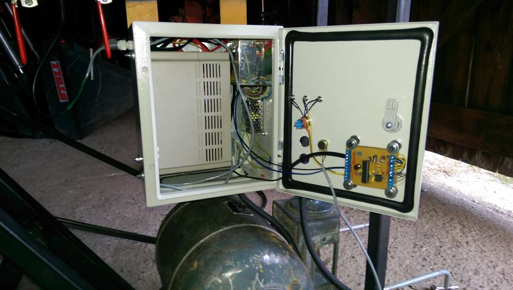
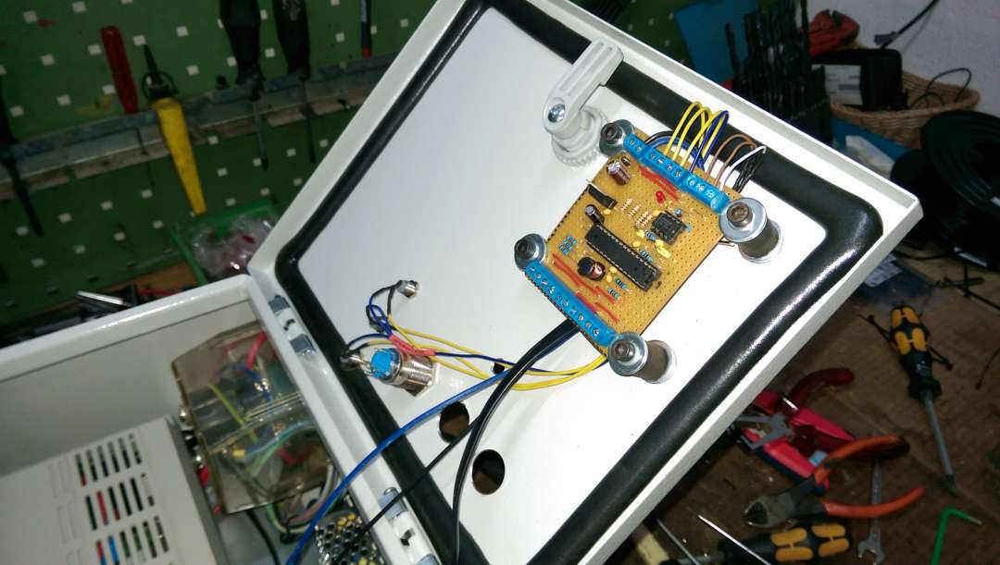

Control VFD driving a water pump. And regulating the water pressure to certain target value using AVR controller and variable frequency drive communicating via RS485

# hardware
- custom stripboard with atmega 8 uc
- variable frequency drive VFD-M see manual pdf
- 1x potentiometer
- 3x led
- 1x button see photos

# features
- control vfd via modbus
- read pressure sensor, calculate average
- read potentiometer for target pressure
- regulate pressure to target by changing the motor speed

# history
- this was the first approach controlling the water pump to slow down when no water is drawn
- regulation somewhat worked
- unfortunately the VFD died due to vibration

- new one did not support modbus
- stopped using this custom board and firmware -> this is archive now