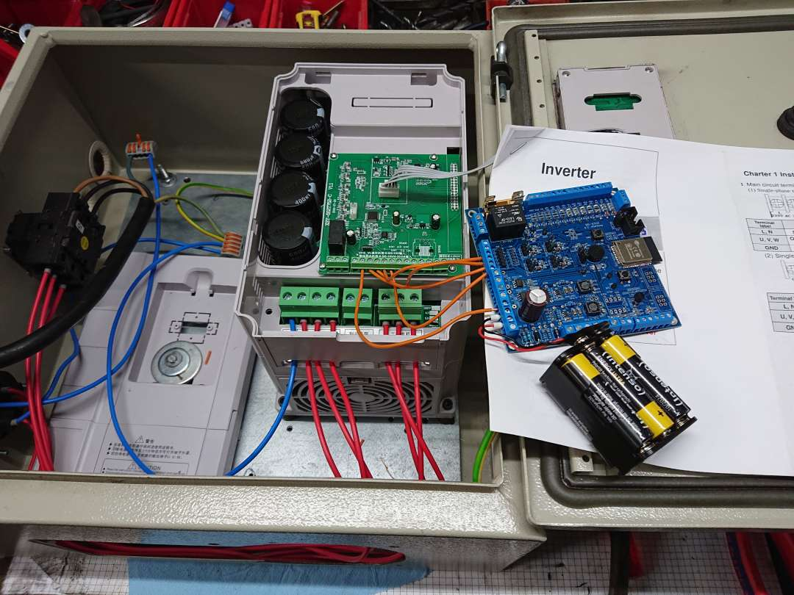

# history
Firmware controlling a VFD powering a waterpump created in 2018 (most code was initially copied from an older project)
- This state was only used to turn on/off and set speed level of the VFD remotely via phone until about 2021
- It replaced the previous control via AVR controller and modbus
- It was planned to implement pressure regulation however started from scratch in 2024, so this is just archive

# features
- connects to wifi
- connects to mqtt broker 10.0.0.102
- subscribes topics to control the vfd (set level)
 => VFD level is then set via nodered dashboard on local server 
- reads pressure sensor

# hardware
custom board (already used in several other projects) with esp32 connected via 4 digital pins (not modbus) see photo:
see 

# installation
- install ESP-IDF v3.4.4

# compile
```
. /opt/esp-idf-v3.4.4/export.sh
idf.py build
```

# upload
```
idf.py build flash monitor
```
